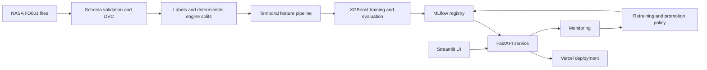

# EngineGuard

Remaining-useful-life prediction for turbofan engines using the NASA C-MAPSS FD001 dataset.

EngineGuard predicts how many operating cycles remain before failure, maps the prediction to a deterministic maintenance-risk level, and demonstrates the complete ML lifecycle: data validation, leakage-safe feature engineering, model evaluation, API serving, monitoring, retraining, promotion, and rollback.

## Dataset and objective

EngineGuard uses the **FD001 subset of the NASA C-MAPSS Jet Engine Simulated Data**. C-MAPSS stands for the Commercial Modular Aero-Propulsion System Simulation, a NASA-developed high-fidelity system-level simulation of a large commercial turbofan engine. The dataset was created for studying engine degradation and prognostics rather than collected from active aircraft. The official NASA record describes FD001 as having 100 training trajectories, 100 test trajectories, one operating condition, and one fault mode: high-pressure compressor degradation. [NASA Open Data Portal](https://data.nasa.gov/dataset/cmapss-jet-engine-simulated-data)

Each trajectory represents one engine observed over operating cycles. Every row contains:

- An engine identifier and cycle number.
- Three operational settings.
- Twenty-one sensor measurements.

The training trajectories run until failure. The test trajectories stop before failure, and `RUL_FD001.txt` supplies the remaining cycles after each test engine's final observed cycle. This creates the same situation that predictive-maintenance systems face in practice: estimate how much useful life remains before the failure event is observed.

The project objective is a supervised regression task:

> Given the observations available for an engine up to its current cycle, predict its remaining useful life (RUL) in operating cycles.

The model output is capped at 125 cycles and then converted into a deterministic maintenance-risk level. The system is designed to demonstrate a leakage-safe, reproducible ML lifecycle on this benchmark—not to claim generalization to real aircraft or other C-MAPSS subsets.

## Live services

The FastAPI model service is deployed at:

**https://nasa-c-mapss.vercel.app**

Available endpoints:

| Endpoint | Purpose |
| --- | --- |
| [`GET /health`](https://nasa-c-mapss.vercel.app/health) | Process health |
| [`GET /ready`](https://nasa-c-mapss.vercel.app/ready) | Model and feature readiness |
| [`GET /model-info`](https://nasa-c-mapss.vercel.app/model-info) | Model metadata |
| `POST /v1/predict` | Predict RUL for one engine history |
| `POST /v1/predict/batch` | Predict RUL for 1–100 engine histories |
| [`OpenAPI documentation`](https://nasa-c-mapss.vercel.app/docs) | Interactive API contract |

The Streamlit application is a separate presentation layer. It calls the Vercel API instead of loading a second copy of the model.

## What the system does

For engine `i` at cycle `t`:

```text
raw_rul(i, t) = maximum_training_cycle(i) - t
target_rul(i, t) = min(raw_rul(i, t), 125)
predicted_rul = clip(model_output, 0, 125)
```

Risk is mapped deterministically:

| Predicted RUL | Risk |
| --- | --- |
| 0–30 cycles | Critical |
| 31–60 cycles | Warning |
| 61–125 cycles | Healthy |

## Results

The model family and hyperparameters were selected using development data and fixed validation samples. The official FD001 test set was held out for one final evaluation.

| Measure | Result |
| --- | ---: |
| Validation engines | 20 |
| Validation samples | 80 |
| Official test engines | 100 |
| Final test predictions | 100 / 100 |
| Final test RMSE | 14.29 cycles |
| Final test MAE | 10.43 cycles |
| Final test R² | 0.873 |
| Predictions within 10 cycles | 62% |
| Predictions within 20 cycles | 84% |
| Predictions within 40 cycles | 99% |
| Final prediction range | 4.34–125 cycles |

Validation model comparison:

| Model | Validation RMSE | Validation MAE | Role |
| --- | ---: | ---: | --- |
| Median baseline | 50.21 | 44.74 | Reference |
| Ridge Regression | 20.50 | 17.05 | Linear baseline |
| Random Forest | 19.23 | 15.04 | Bagging model |
| XGBoost | 16.43 | 12.36 | Selected candidate |

## Architecture



## Data and leakage controls

- Core dataset: NASA C-MAPSS FD001 only.
- Training engines: 100.
- Development engines: `unit_id % 5 != 0` — 80 engines.
- Validation engines: `unit_id % 5 == 0` — 20 engines.
- Initial retraining partition: `unit_id <= 75` and development engines.
- Incremental retraining partition: development engines with `unit_id > 75`.
- No row-level random split is used.
- Future cycles, maximum lifecycle length, raw RUL, and target RUL never enter model features.
- Official test labels are isolated from feature selection, tuning, thresholds, and promotion decisions.

## Temporal features

For each retained setting and sensor, the shared feature builder produces:

- Current value.
- Rolling mean over 5, 10, and 20 cycles.
- Rolling standard deviation over 5, 10, and 20 cycles.
- Five-cycle delta.
- Twenty-cycle linear slope.
- Current cycle and capped available-history count.

Histories require at least 20 strictly increasing observations. The same feature implementation is used by offline training and online API inference, with ordered schema version `v1`.

## Model lifecycle

The project uses MLflow for experiment tracking and model registration. The retraining simulation:

1. Trains the initial champion on the fixed initial-training engines.
2. Treats incremental-training engines as newly labeled data.
3. Trains a challenger on all development engines.
4. Evaluates both on the unchanged validation samples.
5. Promotes only when every gate passes.

Promotion gates include at least 3% RMSE improvement, no worse MAE, complete bounded predictions, p95 latency below 100 ms, registered lineage and artifacts, and passing tests. Failed challengers retain the champion. The previous model and registry version remain available for rollback without retraining.

## Monitoring

The deterministic monitoring simulation covers:

- Normal feature batches.
- Sensor drift detected by population stability index (PSI).
- Schema failure and quarantine for a missing sensor.
- Recovery after the distribution returns to normal.
- Labeled-performance and service-latency alert rules.

Drift is treated as evidence of distribution change, not automatic proof of model degradation or permission to promote a new model.

## Streamlit UI

The UI presents the project like an interactive README and documentation site. It includes:

- Project definition and architecture.
- Data contracts and leakage controls.
- EDA charts and feature decisions.
- Model comparison and measured results.
- Interactive testing through the deployed Vercel API.
- Evaluation limitations.
- Monitoring, retraining, promotion, and rollback explanations.
- Reproduction commands and evidence locations.

To run it locally:

```powershell
cd streamlit_app
streamlit run app.py
```

## Local setup

Python 3.12 is recommended.

```powershell
python -m venv .venv
.venv\Scripts\Activate.ps1
python -m pip install -e ".[training,monitoring,ui,dev]"
```

Validate the raw data and run the test suite:

```powershell
python -m dvc repro validate_raw
python -m pytest -q
```

Run the API locally:

```powershell
python -m uvicorn src.api.app:app --reload
```

Run training and final evaluation:

```powershell
python -m dvc repro train
python -m src.evaluation.final_evaluation
```

## Repository structure

```text
├── api/                    Vercel FastAPI entrypoint
├── configs/                Frozen feature, model, and monitoring configuration
├── data/                   Raw and versioned FD001 data boundaries
├── docs/                   Problem, architecture, design, and decisions
├── models/                 Approved serving model and preprocessor artifacts
├── reports/                Evaluation, monitoring, deployment, and retraining evidence
├── src/
│   ├── api/                FastAPI schemas, service, and endpoints
│   ├── data/               Ingestion, validation, labels, splits, and samples
│   ├── features/           Shared temporal feature pipeline
│   ├── monitoring/         Drift and alert simulation
│   ├── training/           Baselines, tree models, training, and retraining
│   └── evaluation/         Final holdout evaluation and explainability
├── streamlit_app/          Interactive documentation and API-testing UI
├── tests/                  Contract, leakage, model, API, monitoring, and UI tests
├── dvc.yaml                Reproducible data and training stages
└── pyproject.toml          Dependencies and development tooling
```

## Limitations

- FD001 contains one operating condition and one fault mode.
- Results should not be generalized automatically to other C-MAPSS subsets or real engines.
- The public Vercel load test achieved 0% valid-request errors, but measured p95 latency was 998.333 ms, above the local target of 100 ms.
- The public deployment is a portfolio demonstration and does not include authentication or certification controls for aircraft maintenance.
- The Streamlit UI depends on the availability of the Vercel API for live predictions.

## Evidence and documentation

Detailed project memory is maintained in:

- `roadmap.md` — fixed project contract and completion gates.
- `docs/design.md` — current architecture and boundaries.
- `docs/decisions.md` — important technical decisions.
- `docs/tracker.md` — module status and verification evidence.
- `reports/` — measured evaluation, deployment, monitoring, and retraining artifacts.

## License

This repository is intended as an educational and portfolio project. Check the NASA C-MAPSS dataset terms and source requirements before redistributing the raw data.
