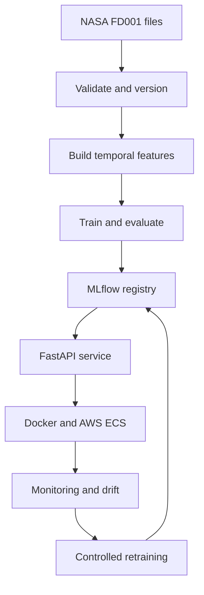

# NASA C-MAPSS ML Engineering Roadmap

## Project: EngineGuard — Turbofan Remaining Useful Life Platform

Build a production-oriented ML system that predicts the **remaining useful life (RUL), in cycles, of a turbofan engine** from its sensor history. This roadmap retains ML and MLOps learning goals, but every module contributes directly to this one fixed project.

Do not change the core dataset, target, split policy, features, required models, metrics, or API contract while completing the roadmap. Additional ideas belong under `experiments/` and must not silently change the main system.

---

# Fixed Project Contract

## Product behavior

EngineGuard receives recent engine sensor observations and returns:

- Predicted RUL in cycles.
- Maintenance risk level.
- Model version.
- Feature schema version.
- Request ID and prediction timestamp.

This is a portfolio demonstration built with simulated data. It is not certified for real aircraft-maintenance decisions.

## Dataset

Use only the **FD001 subset** of NASA C-MAPSS for the core project.

Required files:

```text
train_FD001.txt
test_FD001.txt
RUL_FD001.txt
```

Expected data contract:

| Property | Required value |
| --- | --- |
| Training engines | 100 |
| Test engines | 100 |
| Operating conditions | 1 |
| Fault modes | 1 |
| Operational settings | 3 |
| Sensor measurements | 21 |
| Columns per parsed row | 26 |

Fixed column names:

```text
unit_id, cycle,
op_setting_1, op_setting_2, op_setting_3,
sensor_1, sensor_2, ..., sensor_21
```

Training trajectories run to failure. Test trajectories stop before failure; `RUL_FD001.txt` provides the remaining cycles after the last observation of each test engine.

## Primary task: RUL regression

For engine `i` at cycle `t`:

```text
raw_rul(i, t) = maximum_training_cycle(i) - t
target_rul(i, t) = min(raw_rul(i, t), 125)
```

Store both labels, but train on `target_rul`. At inference:

```text
predicted_rul = clip(model_prediction, 0, 125)
```

The cap of 125 is a fixed modeling choice. Never use an engine's maximum cycle, `raw_rul`, or `target_rul` as a model input.

## Deterministic maintenance-risk mapping

| Predicted RUL | Risk |
| --- | --- |
| `0–30` | `critical` |
| `31–60` | `warning` |
| `61–125` | `healthy` |

Risk is application logic derived from predicted RUL, not a separate deployed model.

## Secondary learning task

To revise classification, create:

```text
failure_within_30 = 1 if raw_rul <= 30 else 0
```

Train and evaluate Logistic Regression on this target. It is a learning artifact and is not served by the final API.

## Deterministic engine partitions

Never randomly split individual rows.

From `train_FD001.txt`:

```text
Validation engines: unit_id % 5 == 0
Development engines: unit_id % 5 != 0
```

This yields 20 validation engines and 80 development engines.

For the retraining demonstration:

```text
Initial-training engines: unit_id <= 75 and unit_id % 5 != 0
Incremental-training engines: unit_id > 75 and unit_id % 5 != 0
```

Use `test_FD001.txt` and `RUL_FD001.txt` only for final evaluation. Never use official test labels for feature selection, tuning, model choice, or acceptance-threshold adjustment.

## Fixed sample policy

- Minimum history: 20 cycles.
- Generate training samples at every eligible cycle from cycle 20 onward.
- Features may use only the current and earlier cycles.
- Generate validation samples at 60%, 70%, 80%, and 90% of each validation engine's lifetime.
- Round each cutoff down and enforce a minimum cycle of 20.
- Deduplicate a cutoff only if rounding produces the same cycle; record the count.
- Generate exactly one final prediction per test engine from its final available cycle.

## Required models

Regression:

1. Median constant predictor.
2. Ridge Regression.
3. Random Forest Regressor.
4. XGBoost Regressor as the primary candidate.

Classification learning artifact:

1. Logistic Regression for `failure_within_30`.

Deep learning is outside the core scope. Add an LSTM or 1D CNN only after the entire classical ML and MLOps system works.

## Global reproducibility rule

Use seed `42` for NumPy, scikit-learn, XGBoost, sampling, drift generation, and randomized tests.

## Fixed acceptance goals

| Area | Goal |
| --- | --- |
| Final FD001 test RMSE | `<= 25` cycles |
| Final FD001 test MAE | `<= 18` cycles |
| Improvement over median baseline | At least `15%` lower RMSE |
| Test prediction coverage | 100 predictions for 100 engines |
| Prediction range | Every result between 0 and 125 |
| Warm local API latency | p95 `< 100 ms` over 100 sequential requests |
| Valid-request error rate | `< 1%` |
| Test coverage | `>= 80%` for `src/` |
| Fixed-seed reproducibility | Repeated RMSE difference `< 0.01` |
| Schema safety | Invalid input produces no prediction |
| Traceability | Every prediction includes model version and request ID |

Quality thresholds are goals, not permission to tune on the test set. If a goal is missed, report the measured result and error analysis honestly.

---

# Fixed System Architecture



| Area | Fixed tool |
| --- | --- |
| Data and modeling | Python, pandas, NumPy, scikit-learn, XGBoost |
| Data validation | Pandera |
| Data/pipeline versioning | DVC |
| Tracking and registry | MLflow |
| Explainability | SHAP |
| API | FastAPI and Pydantic |
| Testing | pytest |
| Packaging | Docker |
| CI | GitHub Actions |
| Drift reporting | Evidently |
| Cloud image registry | Amazon ECR |
| Deployment | Amazon ECS Fargate |
| Model artifacts | Amazon S3 |
| Cloud logs/metrics | Amazon CloudWatch |

Kubernetes, Kafka, Spark, Airflow, a feature store, and distributed training are not core requirements.

---

# Module 1: Repository and System Contracts

## Learn

- Converting a business problem into an ML objective.
- Model requirements versus system requirements.
- Training, validation, testing, and inference boundaries.

## Build

- Create the final repository structure.
- Configure dependencies, formatting, linting, typing, and pytest.
- Write `docs/problem-definition.md` from the fixed contract.
- Write training and inference architecture in `docs/architecture.md`.
- Create YAML configuration for data, features, models, evaluation, and monitoring.
- Provide these commands through a Makefile or equivalent task runner:

```text
make setup
make data
make train
make evaluate
make serve
make test
make monitor
make retrain
```

## Deliver

- Repository skeleton.
- Problem and architecture documents.
- Configuration schemas.
- Setup and smoke-test commands.

## Done when

A clean environment can run `make setup`, followed by a passing `make test` smoke test.

---

# Module 2: ML Foundations Using FD001

## Learn

- Mean, variance, covariance, correlation, and standardization.
- Vectors, matrices, gradients, and gradient descent.
- Linear Regression, Ridge Regression, and squared-error loss.
- Logistic Regression, sigmoid, log loss, and thresholds.
- Regularization, bias, variance, underfitting, and overfitting.

## Build

- Implement Linear Regression using NumPy on a small FD001 feature subset.
- Implement Logistic Regression using NumPy for `failure_within_30`.
- Compare both with scikit-learn.
- Plot convergence for three learning rates.
- Demonstrate the effect of L2 regularization.
- Explain why row-level random splitting leaks engine information.

## Deliver

- `notebooks/01_ml_foundations.ipynb`.
- `docs/ml-fundamentals.md`.
- Unit tests for NumPy implementations.

## Done when

The implementations show the same qualitative behavior as scikit-learn, and the concepts can be explained using the engine-prediction problem.

---

# Module 3: FD001 Ingestion, Validation, and Versioning

## Learn

- Data contracts and schema validation.
- Semantic validation and fail-fast behavior.
- Immutable raw data, lineage, and DVC.

## Build

- Store the three unchanged source files in `data/raw/`.
- Parse whitespace-separated values and assign the fixed schema.
- Remove only empty trailing fields caused by parsing.
- Require numeric columns and exactly 26 parsed fields.
- Require 100 unique engines in training and test data.
- Require exactly 100 RUL values.
- Require each engine's cycles to start at 1 and increase without duplicates.
- Store file checksums.
- Track raw and processed data with DVC.
- Stop before feature generation if validation fails.

## Deliver

- `src/data/ingest.py` and `src/data/schema.py`.
- DVC data stage.
- Validation tests and data-quality report.

## Done when

Valid FD001 files pass; fixtures with missing columns, duplicate cycles, bad types, or missing engines fail with specific errors.

---

# Module 4: FD001 Exploratory Analysis

## Learn

- Distributions, outliers, correlations, and temporal behavior.
- Constant features and multicollinearity.
- Dataset scope and limits of generalization.

## Build

- Report row counts, engine counts, and lifecycle-length distribution.
- Plot shortest, median-length, and longest engine trajectories.
- Plot the three operating settings.
- Calculate variance for all sensors using development engines only.
- Identify constant and near-constant columns without test data.
- Plot correlations and representative sensor degradation trends.
- Document that FD001 is simulated with one operating condition and one fault mode.
- Commit the list of excluded near-zero-variance columns.

## Deliver

- `notebooks/02_fd001_eda.ipynb`.
- `docs/data-dictionary.md`.
- `reports/fd001-profile.html`.
- Versioned excluded-feature list.

## Done when

The analysis clearly explains retained features, excluded features, dataset limitations, and why FD001 results cannot be generalized automatically to real engines or other subsets.

---

# Module 5: Labels, Splits, and Leakage Controls

## Learn

- Target construction and capping.
- Entity leakage and temporal leakage.
- Development, validation, and final-test roles.

## Build

- Calculate `raw_rul`, `target_rul`, and `failure_within_30` exactly as specified.
- Materialize fixed development and validation engine manifests.
- Materialize initial and incremental training manifests.
- Generate eligible training rows from cycle 20.
- Generate the four validation cutoffs per engine.
- Generate one final sample per test engine.
- Add automated checks that no engine crosses train/validation boundaries.
- Assert that labels and maximum lifecycle length never enter feature inputs.

## Deliver

- `src/data/labels.py` and `src/data/splits.py`.
- Versioned split manifests.
- `docs/leakage-analysis.md`.
- Label and split tests.

## Done when

Validation has up to 80 documented evaluation samples, final test has exactly 100 samples, and all leakage checks pass.

---

# Module 6: Fixed Temporal Feature Pipeline

## Learn

- Scaling and leakage-safe fitting.
- Lag, rolling, trend, and delta features.
- Training-serving feature parity.

## Generate these features for each retained setting and sensor

- Current value.
- Rolling mean over 5, 10, and 20 cycles.
- Rolling standard deviation over 5, 10, and 20 cycles.
- Current value minus the value five cycles earlier.
- Linear slope over the last 20 cycles.

Also include:

- Current cycle.
- Available-history count capped at 20.

## Build

- Fit near-zero-variance filtering only on development data.
- Fit scaling only on development data and only for models that need it.
- Implement one feature function shared by training, batch scoring, and the API.
- Reject histories shorter than 20 cycles.
- Accept longer histories while using the fixed rolling windows.
- Persist ordered feature names and schema version `v1`.

## Deliver

- `src/features/build_features.py`.
- Feature configuration and ordered feature contract.
- Serialized preprocessing artifacts.
- Boundary, leakage, and feature-parity tests.

## Done when

The same engine history produces identical feature values through offline and API code paths.

---

# Module 7: Baseline Regression and Classification Lab

## Learn

- Non-ML baselines and linear model assumptions.
- Regression metrics.
- Imbalanced classification, PR-AUC, and threshold selection.

## Build

- Train the median RUL predictor.
- Train Ridge Regression on standardized features.
- Train Logistic Regression for `failure_within_30`.
- Evaluate regression with RMSE, MAE, and R-squared.
- Evaluate classification with precision, recall, F1, ROC-AUC, PR-AUC, and confusion matrix.
- Compare the default classification threshold with a recall-oriented threshold.
- Record training time, inference time, and model size.
- Log every run to MLflow.

## Deliver

- Baseline training code.
- `reports/baseline-results.md`.
- Metric and plot artifacts.
- MLflow baseline runs.

## Done when

The project has a numeric median RMSE baseline and explains why accuracy alone is misleading for the derived failure classification task.

---

# Module 8: Random Forest and XGBoost

## Learn

- Tree splits, bagging, and boosting.
- Group-aware cross-validation.
- Hyperparameters and search budgets.

## Build

- Train Random Forest Regressor.
- Train XGBoost Regressor.
- Use five-fold `GroupKFold` by `unit_id` on development engines.
- Run `RandomizedSearchCV` over exactly 30 XGBoost configurations with seed 42.
- Use negative RMSE as the search score.
- Use only these values:

```yaml
n_estimators: [100, 200, 400, 600]
max_depth: [2, 3, 4, 6]
learning_rate: [0.01, 0.03, 0.05, 0.1]
subsample: [0.7, 0.85, 1.0]
colsample_bytree: [0.7, 0.85, 1.0]
min_child_weight: [1, 3, 5]
reg_alpha: [0.0, 0.01, 0.1]
reg_lambda: [1.0, 5.0, 10.0]
```

- Evaluate the selected configuration once on fixed validation samples.
- Compare Ridge, Random Forest, and XGBoost on identical samples.

## Deliver

- Model training and tuning modules.
- MLflow trials.
- Model-comparison report.
- Frozen candidate configuration.

## Done when

The candidate is selected from validation evidence using RMSE, MAE, fold stability, latency, and size—without accessing official test labels.

---

# Module 9: Final Test Evaluation and Explainability

## Learn

- Final holdout evaluation and error analysis.
- Metric uncertainty and slice evaluation.
- SHAP importance versus causality.

## Build

- Freeze feature and model configuration.
- Retrain the candidate on all 80 development engines.
- Evaluate exactly once on all 100 official test engines.
- Report RMSE, MAE, R-squared, and NASA asymmetric score.
- Report predictions within 10, 20, and 40 cycles of truth.
- Analyse errors by true-RUL bands: `0–30`, `31–60`, and `>60`.
- Inspect five largest underpredictions and overpredictions.
- Generate global SHAP importance and three local explanations.
- State explicitly that SHAP does not establish sensor causality.

## Deliver

- `reports/final-evaluation.md`.
- Machine-readable metrics.
- A 100-row prediction file.
- `notebooks/03_error_analysis.ipynb`.
- Model card.

## Done when

Exactly 100 bounded predictions exist, fixed goals are reported honestly, and no test-driven retuning occurs.

---

# Module 10: Reproducible Training and Model Registry

## Learn

- Idempotent pipelines and reproducibility.
- Code, data, configuration, feature, and model lineage.
- Model registry, candidate, and champion concepts.

## Fixed pipeline

```text
ingest -> validate -> label -> split -> features -> train -> evaluate -> register
```

## Build

- Move reusable logic out of notebooks.
- Define stages in `dvc.yaml`.
- Log dataset checksum, DVC revision, Git commit, configuration, metrics, plots, and models to MLflow.
- Register only models with all required evaluation artifacts.
- Use MLflow aliases `candidate` and `champion`.
- Repeat a fixed-seed training run and compare RMSE.
- Return non-zero exit codes for failed stages.

## Deliver

- `src/training/` package.
- DVC pipeline.
- MLflow experiment and registered candidate.
- Reproduction instructions.

## Done when

`make train` rebuilds the model without notebooks, and a registered version can be traced to exact data, code, features, parameters, and metrics.

---

# Module 11: Fixed FastAPI Service

## Learn

- Online versus batch inference.
- Typed contracts, validation, warm starts, and readiness.
- Prediction traceability and safe logging.

## Required endpoints

| Endpoint | Behavior |
| --- | --- |
| `POST /v1/predict` | Score one engine history |
| `POST /v1/predict/batch` | Score 1–100 histories |
| `GET /health` | Confirm process health |
| `GET /ready` | Confirm model and feature contract are loaded |
| `GET /model-info` | Return model, data, and feature-schema versions |

## Response contract

```json
{
  "unit_id": "engine-001",
  "predicted_rul": 42.7,
  "risk_level": "warning",
  "model_version": "string",
  "feature_schema_version": "v1",
  "request_id": "uuid",
  "predicted_at": "ISO-8601 timestamp"
}
```

## Build

- Define a request containing `unit_id` and ordered observations with cycle, all three settings, and all 21 sensors.
- Load the champion once during startup.
- Require at least 20 strictly increasing observations.
- Reject duplicate cycles, missing fields, non-numeric values, infinities, and unexpected fields.
- Clip output to `0–125` and derive risk deterministically.
- Log request ID, latency, result, validation status, and model version.
- Do not log full sensor payloads by default.

## Deliver

- `src/api/` application.
- OpenAPI documentation.
- Examples and contract tests.

## Done when

Valid histories match offline predictions, invalid histories produce no prediction, and every success matches the fixed response schema.

---

# Module 12: Tests, Docker, and CI

## Learn

- Unit, integration, contract, regression, and end-to-end testing.
- Reproducible environments and CI gates.

## Required tests

- Data schema and RUL-label tests.
- Split and leakage tests.
- Feature-window boundary tests.
- Offline/online feature-parity test.
- Serialization and prediction-range tests.
- API contract and malformed-input tests.
- Batch-size limit test.
- Small end-to-end training/serving smoke test.

## Build

- Create a multi-stage Dockerfile running as non-root.
- Add container health and readiness checks.
- Pin production dependencies.
- Configure GitHub Actions for format, lint, type check, tests, coverage, smoke training, and Docker build.
- Scan dependencies and container image.

## Deliver

- Test suite.
- Dockerfile.
- GitHub Actions workflow.
- Coverage and security reports.

## Done when

CI passes from a clean checkout, `src/` coverage is at least 80%, and the container passes readiness and prediction tests.

---

# Module 13: Vercel Serverless Deployment

## Learn

- Serverless Python functions, framework detection, bundle boundaries, and deployment verification.

## Architecture

```text
Git repository -> Vercel Python Function -> FastAPI -> bundled model artifacts
                                      |-> Vercel function logs and metrics
```

## Build

- Export the FastAPI app through `api/index.py`.
- Bundle only the approved candidate model and development preprocessor.
- Configure Python 3.12 and exclude raw data, reports, tests, and unused artifacts.
- Deploy the function through a connected Git repository.
- Configure health/readiness checks and externalized settings.
- Send 100 sequential requests after warm-up.
- Record p50, p95, p99 latency and error rate, including cold-start behavior.
- Document rollback to a prior Vercel deployment and champion.
- Keep AWS as a documented future production option; do not provision paid resources.

## Deliver

- Vercel deployment configuration and entry point.
- Deployed API or documented deployment limitation.
- Deployment diagram.
- Load-test report.
- Deployment and rollback runbook.

## Done when

The service loads the approved bundled model, passes checks, serves predictions, and rolls back without retraining; if public deployment is unavailable, the limitation and local equivalent are documented honestly.

---

# Module 14: Fixed Monitoring and Drift Simulation

## Learn

- Service health versus ML health.
- Data quality, data drift, prediction drift, concept drift, and model decay.
- Delayed labels and actionable alerting.

## Reference data

Use a seed-42 sample of 5,000 rows from the final development feature matrix.

## Simulated batches

Create ten batches of 1,000 samples:

| Batch | Fixed contents |
| --- | --- |
| 1–5 | Bootstrap valid validation feature rows |
| 6–8 | Shift raw `sensor_2` by `+2` development standard deviations and `sensor_11` by `-1.5` before feature computation |
| 9 | Remove `sensor_5` to create an invalid schema |
| 10 | Return to normal valid data |

Use seed 42.

## Alert rules

- Reject any batch with missing required fields, invalid types, or non-finite values.
- Feature drift warning when PSI `> 0.20`.
- Feature drift critical when PSI `> 0.30`.
- Performance warning when labeled RMSE exceeds `120%` of frozen validation RMSE.
- Service warning when p95 latency exceeds `100 ms` for two consecutive batches.

## Build

- Record volume, errors, latency, prediction/risk distributions, schema version, and model version.
- Generate Evidently comparison reports.
- Quarantine batch 9 without scoring it.
- Verify drift alerts for shifted batches.
- Verify normal processing resumes for batch 10.
- Explain why drift does not alone prove concept drift or justify promotion.

## Deliver

- `src/monitoring/` pipeline.
- Deterministic batch generator.
- Ten reports and an alert log.
- Monitoring summary.

## Done when

The injected drift is detected, invalid data is rejected, recovery succeeds, and all events identify the active model.

---

# Module 15: Retraining and Safe Promotion

## Learn

- Retraining triggers, champion-challenger evaluation, promotion, and rollback.

## Fixed simulation

- Train the initial champion on initial-training engines.
- Treat incremental-training engines as newly labeled production data.
- Trigger retraining if the same feature has PSI above 0.20 in two consecutive valid batches, or labeled RMSE exceeds 120% of the champion's frozen validation RMSE.
- Train the challenger on initial plus incremental engines.
- Compare both on the unchanged 20-engine validation set.

## Promotion gates

Promote only if all pass:

- Validation RMSE improves by at least 3%.
- Validation MAE is no worse.
- All required predictions are produced.
- Outputs remain within `0–125` after clipping.
- Local p95 latency remains below `100 ms`.
- Data, code, feature schema, metrics, and artifacts are registered.
- All tests pass.

Otherwise retain the champion and record every rejection reason.

## Deliver

- `src/training/retrain.py`.
- Promotion-policy implementation.
- Champion-challenger report.
- Transition audit log and rollback test.

## Done when

The pipeline makes the gate-defined decision, a failed challenger cannot replace the champion, and rollback restores the previous model without retraining.

---

# Module 16: Reliability, Security, and Cost

## Learn

- Timeouts, retries, idempotency, least privilege, abuse limits, and cost trade-offs.

## Build

- Limit batch requests to 100 engines.
- Limit history length and request size.
- Add timeouts and typed errors.
- Never retry invalid input.
- Add authentication for a non-public deployment.
- Keep secrets outside source and images.
- Restrict S3 permission to required model paths.
- Estimate ECR, S3, ECS, and CloudWatch demonstration costs.
- Compare always-on service cost with scheduled batch inference.
- Write a lightweight threat model.

## Deliver

- `docs/threat-model.md`.
- `docs/cost-analysis.md`.
- Security checklist and failure tests.

## Done when

The API fails safely, secrets are absent from source, permissions are scoped, and deployment choice has a cost justification.

---

# Module 17: Benchmark, Documentation, and Resume Package

## Learn

- Model evaluation versus system evaluation.
- Accuracy, latency, reliability, and cost trade-offs.
- Evidence-based project communication.

## Final comparison

For Median, Ridge, Random Forest, and XGBoost, report:

- Validation RMSE and MAE.
- Final test RMSE and MAE where applicable.
- Training time.
- Warm p95 latency.
- Serialized size.
- Peak inference memory.

## Build

- Run one final reproducible benchmark.
- Complete README sections for problem, dataset, architecture, experiments, deployment, monitoring, retraining, limitations, and reproduction.
- Add architecture and pipeline diagrams.
- Add screenshots of MLflow, OpenAPI, CI, drift report, and deployment.
- Record a demonstration from ingestion through retraining decision.
- Write resume bullets using only measured results.
- Prepare an interview walkthrough.

## Deliver

- Final benchmark.
- Complete README.
- Model card and data card.
- Demonstration assets.
- Resume entry and interview question bank.

## Done when

A new developer can reproduce the project, every resume claim maps to evidence, and the system can be explained from raw FD001 files through monitoring and rollback.

---

# Repository Structure

```text
engineguard-cmapss/
├── .github/workflows/ci.yml
├── configs/
│   ├── data.yaml
│   ├── evaluation.yaml
│   ├── features.yaml
│   ├── model.yaml
│   └── monitoring.yaml
├── data/
│   ├── raw/
│   ├── interim/
│   ├── processed/
│   └── manifests/
├── docs/
├── experiments/
├── models/
├── notebooks/
│   ├── 01_ml_foundations.ipynb
│   ├── 02_fd001_eda.ipynb
│   └── 03_error_analysis.ipynb
├── reports/
├── src/
│   ├── api/
│   ├── data/
│   ├── evaluation/
│   ├── features/
│   ├── monitoring/
│   ├── training/
│   └── utils/
├── tests/
│   ├── fixtures/
│   ├── integration/
│   └── unit/
├── Dockerfile
├── dvc.yaml
├── Makefile
├── pyproject.toml
└── README.md
```

---

# ML Revision Checklist

- [ ] Linear and Logistic Regression.
- [ ] MSE, RMSE, MAE, log loss, and metric trade-offs.
- [ ] Gradient descent and regularization.
- [ ] Bias-variance trade-off.
- [ ] Leakage and group-aware validation.
- [ ] Scaling and temporal feature engineering.
- [ ] Decision Trees, Random Forest, and bagging.
- [ ] Gradient boosting and XGBoost.
- [ ] Hyperparameter search and cross-validation.
- [ ] Classification imbalance and thresholds.
- [ ] Regression error analysis.
- [ ] SHAP and its limitations.
- [ ] Final-holdout generalization.

---

# MLOps Revision Checklist

- [ ] Data, code, configuration, feature, and model versioning.
- [ ] Reproducible pipelines and experiment tracking.
- [ ] Model registry, candidate, champion, and challenger.
- [ ] Online and batch inference.
- [ ] Typed serving contracts.
- [ ] Unit, integration, regression, and end-to-end tests.
- [ ] Docker and CI gates.
- [ ] Cloud deployment and rollback.
- [ ] Service health versus ML health.
- [ ] Data quality, drift, concept drift, and model decay.
- [ ] Delayed-label monitoring.
- [ ] Retraining and safe promotion.
- [ ] Traceability, security, reliability, and cost.

---

# Definition of Done

- FD001 is validated and versioned.
- Labels and engine partitions match the fixed contract.
- Training and serving use the same feature implementation.
- All required models have reproducible results.
- Logistic Regression classification learning is documented.
- Final evaluation contains exactly 100 test predictions.
- Results are reported without test-set tuning.
- Model, data, code, features, parameters, and metrics are traceable.
- All five API endpoints follow their contracts.
- Invalid data cannot produce predictions.
- Tests, coverage, Docker, and CI gates pass.
- The fixed AWS deployment works or its limitation is documented explicitly.
- Drift simulation produces the expected alerts and rejection.
- Retraining evaluates a challenger using every promotion gate.
- Champion rollback works without retraining.
- README, model card, benchmarks, and resume bullets use measured evidence.
